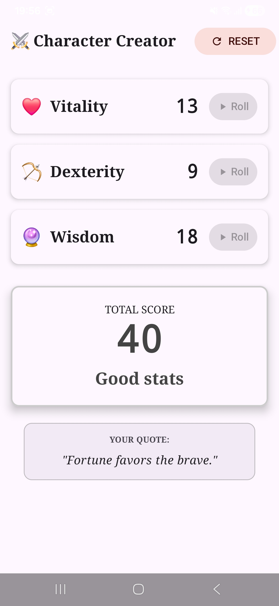
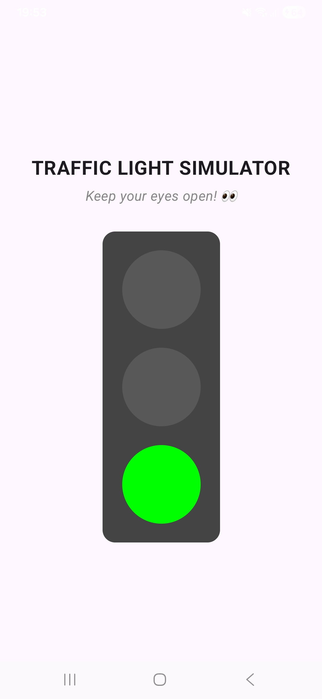

# 📱 Android Studio Module 1: State & Coroutines

Este repositorio contiene dos proyectos prácticos desarrollados con **Kotlin** y **Jetpack Compose**. El objetivo principal es demostrar el dominio de la gestión de estado, el ciclo de vida de la UI, animaciones con corrutinas y manejo de efectos secundarios (Side Effects).

---

## Tech Stack & Conceptos Clave
* **Lenguaje:** Kotlin
* **UI Toolkit:** Jetpack Compose (Material 3)
* **Arquitectura:** MVVM (Model-View-ViewModel pattern concepts)
* **Concurrencia:** Kotlin Coroutines (`launch`, `delay`, `suspend`)
* **Gestión de Estado:** `remember`, `rememberSaveable`, `mutableStateOf`, State Hoisting.
* **Side Effects:** `LaunchedEffect`

---

## ⚔️ Proyecto 1: RPG Character Creator
Una aplicación interactiva para la creación de personajes de rol, que simula el lanzamiento de dados para determinar estadísticas vitales.

  

### Características Principales
* **Generación de Stats:** Tres filas independientes (Vitality, Dexterity, Wisdom) con botones de lanzamiento individuales.
* **Animación de Dados:** Simulación visual de "rolling" utilizando Corrutinas para iterar valores rápidamente antes de establecer el resultado final.
* **Feedback Visual y Auditivo:**
    * Mensajes de estado dinámicos ("Godlike", "Re-roll recommended") basados en lógica de negocio condicional.
    * Integración de efectos de sonido (`MediaPlayer`) sincronizados con la acción del usuario.
    * Frases aleatorias de estilo RPG al finalizar la creación.
* **Persistencia de UI:** Uso de `rememberSaveable` para mantener los valores de los dados y bloqueos durante la rotación de pantalla.

###  Implementación Técnica
* **State Hoisting:** El estado se eleva al componente padre (`DiceRollerScreen`) para permitir que la lógica de negocio (suma total, validación de fin de juego) reaccione a cambios en los hijos (`StatRow`).
* **Coroutines:** Se utiliza `rememberCoroutineScope` para lanzar procesos en el hilo principal sin bloquear la UI, usando `delay()` para crear el efecto de animación.
* **Material Design:** Uso de `Card`, `Scaffold` e `Icons` para una interfaz limpia y moderna.

---

## 🚦 Proyecto 2: Traffic Light Simulator
Un simulador de semáforo automatizado diseñado para practicar el manejo de tiempos y efectos lanzados que no dependen de la interacción del usuario.

  

###  Características Principales
* **Ciclo Automatizado:** El semáforo cambia de estados automáticamente en un bucle infinito.
* **Timing Preciso:**
    * 🔴 Rojo: 2 segundos
    * 🟢 Verde: 2 segundos
    * 🟡 Amarillo: 1 segundo
* **Representación Visual:** Cambio dinámico de opacidad y brillo para simular luces encendidas/apagadas.
* **Interfaz:** Diseño centrado con mensajes de advertencia ("Keep your eyes peeled!").

###  Implementación Técnica
* **LaunchedEffect:** Se utiliza `LaunchedEffect(Unit)` para iniciar el ciclo de vida del semáforo tan pronto como el componente entra en la composición. Esto asegura que el código corra una sola vez y se cancele si la UI se destruye.
* **Gestión de Estado con Enums:** Se define un `enum class TrafficLightState { Red, Yellow, Green }` para manejar los estados de forma segura (Type-Safety), evitando errores lógicos.
* **Bucle Infinito Controlado:** Implementación de `while(true)` dentro de una corrutina estructurada, permitiendo la ejecución continua sin congelar la interfaz de usuario gracias a las funciones de suspensión.

---

## 📸 Cómo probar el proyecto
Dado que este repositorio contiene dos proyectos independientes en la misma estructura de carpetas:

1.  **Clonar el repositorio** en tu máquina local.
2.  Abrir **Android Studio**.

### Para ejecutar Character Creator:
3.  Selecciona **File > Open** y elige la carpeta raíz del repositorio (`DiceRoller` o el nombre principal).
4.  Ejecuta el módulo `app` con el botón de Play ▶️.

### Para ejecutar Traffic Light:
3.  Selecciona **File > Open** y navega dentro del repositorio hasta seleccionar la carpeta **`TrafficLight`**.
4.  Android Studio abrirá esto como un proyecto separado.
5.  Ejecuta el módulo `app` con el botón de Play ▶️.

---
*Desarrollado como parte del Módulo 1 de Fundamentos Avanzados de Aplicaciones Web*
